## What is Kubernetes?

Kubernetes là một hệ thống mã nguồn mở dùng để tự động hóa việc deployment, scaling và quản lý các ứng dụng được chứa trong container”.

## The benefits of Kubernetes

Kubernetes có khả năng di động cao trên nhiều nền tảng đám mây và đơn giản hóa việc quản lý container trên bất kỳ nền tảng nào đang được sử dụng. Kubernetes giúp dễ dàng đạt được khả năng scalability, flexibility và productivity.

## What features does Kubernetes offer?

Kubernetes là một trong những dự án phần mềm nguồn mở phát triển nhanh nhất hiện nay. Dưới đây là một số lý do:
- Có thể gửi các triển khai đến một đám mây hoặc nhiều dịch vụ đám mây mà không làm mất bất kỳ chức năng hoặc hiệu suất nào của ứng dụng.
- Khả năng tự động hóa của Kubernetes xử lý việc lập lịch và triển khai container bất kể container đó đến từ đâu (tại chỗ, đám mây hoặc các nền tảng khác). Tính năng tự động   hóa cũng tự động tăng hoặc giảm quy mô để tăng hiệu quả và giảm thiểu lãng phí, đồng thời tạo ra các container mới nếu khối lượng công việc lớn.
- Kubernetes cho phép khôi phục lại thay đổi của ứng dụng nếu có sự cố xảy ra.
- Bản chất mã nguồn mở của Kubernetes cho phép người dùng tận dụng hệ sinh thái rộng lớn của các công cụ mã nguồn mở.
- Phần mềm không bao giờ lỗi thời do đã có phiên bản trước đó – nó luôn được cập nhật.

## The role of containers

Container là một công nghệ gọn nhẹ cho phép bạn chạy ứng dụng và các dependencies của nó một cách an toàn mà không ảnh hưởng đến các container khác hoặc hệ điều hành (HĐH) của bạn. Điều này giúp container linh hoạt và có khả năng mở rộng hơn so với việc sử dụng các công cụ quản lý ứng dụng khác, chẳng hạn như máy ảo (VM) hoặc máy chủ vật lý (bare metal). Giống như VM, container có thể repeat ứng dụng khi nó đang được phát triển, nhưng không giống như VM, container không sao chép hệ điều hành mỗi lần mà thay vào đó chia sẻ cơ sở hạ tầng, công nghệ container (ví dụ: Docker) và hệ điều hành với máy chủ. Container gọn nhẹ và dễ chạy hơn trên đám mây vì hệ điều hành không bị sao chép cùng với ứng dụng, nhưng công nghệ container có thể khó quản lý nếu không có công cụ.

## Kubernetes Architecture

Kubernetes có thể được hình dung như một hệ thống được xây dựng theo từng layers, với mỗi layers cao hơn trừu tượng hóa độ phức tạp của các layers thấp hơn.

Kubernetes tập hợp các máy vật lý hoặc máy ảo riêng lẻ thành một cluster, sử dụng shared network để giao tiếp giữa mỗi server, dù là máy vật lý hay máy ảo. cluster Kubernetes này là nền tảng vật lý nơi tất cả các Kubernetes components, capabilities và workloads của Kubernetes được cấu hình.

Mỗi server trong cluster Kubernetes đều được giao một vai trò trong hệ sinh thái Kubernetes. Một server (hoặc một nhóm nhỏ trong các triển khai có tính khả dụng cao) hoạt động như master server . Server này đóng vai trò là gateway và bộ não cho cluster bằng cách cung cấp API Kubernetes cho user và client, kiểm tra tình trạng các server khác, quyết định cách phân chia và phân công công việc tốt nhất (được gọi là "scheduling") và điều phối giao tiếp giữa các components khác (đôi khi được gọi là điều phối container). Master server đóng vai trò là primary point với cluster và chịu trách nhiệm cho hầu hết các logic tập trung mà Kubernetes cung cấp.

Các server khác trong cluster được chỉ định là các nút (node) : server chịu trách nhiệm tiếp nhận và chạy workloads bằng local and resources bên ngoài. Để hỗ trợ việc isolation, management, và flexibility, Kubernetes chạy các applications và services trong các container , vì vậy mỗi node cần được trang bị một môi trường chạy container (như Docker hoặc rkt). Node này nhận lệnh làm việc từ master server và tạo hoặc hủy container tương ứng, đồng thời điều chỉnh các networking rules để định tuyến và forward traffic một cách phù hợp.

Như đã đề cập ở trên, các applications và services được chạy trên cụm bên trong các container. Các thành phần cơ bản đảm bảo trạng thái mong muốn của các ứng dụng khớp với trạng thái thực tế của cluster. User tương tác với cluster bằng cách giao tiếp trực tiếp với main Kubernetes API server hoặc với client và libraries. Để khởi động một application or service, một a declarative plan được gửi dưới dạng JSON hoặc YAML, xác định những gì cần tạo và cách quản lý nó. Sau đó, Master server sẽ tiếp nhận plan và tìm ra cách chạy nó trên infrastructure bằng cách kiểm tra các yêu cầu và trạng thái hiện tại của hệ thống. Nhóm các ứng dụng do người dùng định nghĩa này chạy theo một kế hoạch cụ thể đại diện cho layer cuối cùng của Kubernetes.

## Master Server Components

Master server đóng vai trò là primary control plane cho các cluster Kubernetes. Nó đóng vai trò là main contact point for administrators và users, đồng thời cung cấp nhiều hệ thống cluster-wide cho các node làm việc tương đối đơn giản. Nhìn chung, các thành phần trên master server phối hợp với nhau để tiếp nhận request của user, xác định cách tốt nhất để lên schedule cho các container workload containers, authenticate clients and nodes, điều chỉnh cluster-wide networking và quản lý scaling and health checking responsibilities

Các thành phần này có thể được cài đặt trên một server duy nhất hoặc phân phối trên nhiều server.

### etcd

Một trong những thành phần cơ bản mà Kubernetes cần để hoạt động là kho lưu trữ cấu hình có sẵn trên toàn cầu. Project etcd được phát triển bởi nhóm CoreOS (operating system), là một stores key-value distributed, lightweight, có thể được config để trải rộng trên nhiều node. etcd lưu toàn bộ dữ liệu cấu hình và trạng thái của Kubernetes

Kubernetes sử dụng etcd để lưu trữ data config, có thể được access bởi từng node trong cluster. data này có thể được sử dụng để service discovery và giúp các component tự config hoặc config lại theo thông tin cập nhật. Nó cũng giúp maintain cluster state với các tính năng như leader election và  distributed locking. Bằng cách cung cấp API HTTP/JSON đơn giản, interface để thiết lập hoặc truy xuất giá trị rất trực quan.

Giống như hầu hết các thành phần khác trong control plane, etcd có thể được config trên một master server duy nhất hoặc, trong production được phân phối giữa nhiều server. Yêu cầu duy nhất là nó phải có thể truy cập mạng được từ mỗi server Kubernetes.

- etcd được thiết kế phân tán → có thể chạy trên nhiều node khác nhau (gọi là etcd cluster).
- Mỗi thay đổi (vd: tạo Pod, xóa Service) đều được ghi vào etcd thông qua API Server.
- Các thành phần khác của Kubernetes (Controller, Scheduler, Kubelet…) sẽ đọc / xem thay đổi trong etcd thông qua API Server để cập nhật hành động tương ứng.

Ex Etcd lưu gì
| Thành phần | Dữ liệu được lưu trong etcd |
| -----------|-----------------------------|
| Pod | Tên, trạng thái (Running, Pending…), vị trí Node |
| Deployment | Thông tin replicas, labels, version |
| Service | Địa chỉ IP, port, selector |
| ConfigMap / Secret | Các cấu hình và biến môi trường |
| Node | Trạng thái, thông tin sức khỏe |

=> etcd = “bộ nhớ trung tâm” của Kubernetes, lưu mọi thứ về trạng thái của cluster.
Không có etcd → Kubernetes không biết mình đang điều khiển cái gì.

### kube-apiserver

kube-apiserver là thành phần trung tâm (gateway) của toàn bộ Kubernetes cluster.
Nó là “bộ não điều phối” — nơi tất cả các thành phần khác (và cả bạn) phải giao tiếp thông qua.

| Vai trò	| Giải thích |
|-----------| -----------|
| 1. Giao tiếp trung tâm (entry point) | Mọi lệnh, thao tác, hoặc truy vấn trong Kubernetes đều đi qua API Server. |
| 2. Quản lý trạng thái cluster | API Server là cầu nối giữa người dùng ↔ etcd, đảm bảo trạng thái mong muốn (desired state) và trạng thái thực tế (actual state) luôn đồng bộ |
| 3. Giao tiếp giữa các thành phần | Controller, Scheduler, Kubelet... đều dùng API Server để đọc/ghi dữ liệu về cluster. |
| 4. Cung cấp REST API chuẩn | API Server triển khai giao tiếp theo chuẩn RESTful API, giúp bất kỳ công cụ nào (như kubectl, hoặc ứng dụng ngoài) đều có thể tương tác dễ dàng. |

Ví dụ chạy lệnh:

> kubectl create -f deployment.yaml

Luồng hoạt động:

- kubectl gửi request REST đến API Server (qua HTTPS).
- API Server xác thực (authentication), kiểm tra quyền (authorization).
- Nếu hợp lệ → ghi thông tin Deployment vào etcd (desired state).
- Controller Manager phát hiện thay đổi trong etcd → tạo ReplicaSet, Pod, v.v.
- Scheduler chọn node phù hợp cho các Pod đó.

=> Tất cả giao tiếp đều thông qua API Server, chứ không có thành phần nào nói chuyện trực tiếp với nhau.

Một số nhiệm vụ khác:

- Authentication: Kiểm tra ai đang gửi request (qua token, cert, v.v.)
- Authorization: Kiểm tra người đó có quyền thực hiện hành động không (RBAC)
- Admission Control: Kiểm tra và chặn/cho phép request trước khi ghi vào etcd
- Validation: Đảm bảo dữ liệu hợp lệ trước khi lưu

kubectl chỉ là client mặc định để bạn tương tác với API Server.
Thực tế, bạn có thể dùng bất kỳ HTTP client nào để gọi REST API (Postman, curl, v.v.) vì API Server hoạt động theo chuẩn RESTful.

### kube-controller-manager

kube-controller-manager là một service trong control plane (máy master), nó chịu trách nhiệm duy trì trạng thái mong muốn (desired state) của cluster.

Hiểu đơn giản: Controller Manager = “người giám sát” trong Kubernetes. Nó theo dõi xem hệ thống thực tế đang như thế nào, và tự động điều chỉnh để khớp với trạng thái mà người dùng đã khai báo.

#### Cách hoạt động

- Bạn khai báo cấu hình (ví dụ: Deployment.yaml), nói rằng muốn 3 replicas của một Pod.
- API Server ghi thông tin này vào etcd.
- Controller Manager theo dõi (watch) etcd thông qua API Server.
- Khi nó thấy rằng chỉ có 2 Pods đang chạy thực tế, nhưng bạn muốn 3 -> nó sẽ ra lệnh tạo thêm 1 Pod để khớp lại - desired state.

#### Các loại controller quan trọng

kube-controller-manager thực chất chạy nhiều controller nhỏ bên trong, mỗi cái phụ trách một mảng cụ thể.
Dưới đây là một số controller tiêu biểu:

Một số controller tiêu biểu:

| Tên controller | Vai trò |
|----------------|---------|
| Replication / ReplicaSet Controller | Đảm bảo số lượng bản sao (replica) của Pod đúng như khai báo |
| Node Controller | Theo dõi trạng thái của các Node (sống/chết) và phản ứng nếu Node bị mất |
| Deployment Controller |Quản lý việc rolling update, rollback của ứng dụng |
| Service Account & Token Controller | Quản lý các tài khoản dịch vụ và token cho Pod |
| Endpoint Controller | Cập nhật danh sách endpoint cho Service (Pod nào thuộc Service nào) |
| Job / CronJob Controller | Quản lý các công việc chạy một lần hoặc theo lịch |

#### Chu trình hoạt động (loop)

- Mỗi controller chạy theo một vòng lặp liên tục (control loop):
- Quan sát trạng thái hiện tại qua API Server (đọc từ etcd).
- So sánh với trạng thái mong muốn (desired state).
- Thực hiện hành động để đồng bộ hai trạng thái.

 => Quá trình này gọi là “self-healing” của Kubernetes.

### kube-scheduler

kube-scheduler là thành phần chịu trách nhiệm chọn node phù hợp để chạy Pod.

Hiểu đơn giản: kube-scheduler là “người phân việc” trong Kubernetes.

Controller Manager có thể yêu cầu: “Cần chạy 3 Pod mới cho ứng dụng A.” Nhưng không chỉ rõ chạy ở Node nào.
-> Lúc này Scheduler sẽ quyết định: Pod nào sẽ được gán (assign) vào Node nào.

#### Vai trò của kube-scheduler

| Chức năng chính | Mô tả |
|-----------------|-------|
| Đọc yêu cầu (requirements) | Đọc thông tin từ Pod spec (CPU, memory, labels, affinity, v.v.) |
| Đọc thông tin cluster | Biết được Node nào đang rảnh, Node nào đã quá tải |
| Chọn Node phù hợp nhất | Dựa trên thuật toán scoring & filtering |
| Gán Pod vào Node | Ghi thông tin scheduling vào etcd qua API Server |

#### Cách hoạt động cụ thể

1. Controller Manager tạo ra một Pod (chưa có node gán) → trạng thái là Pending.
2. Scheduler đọc danh sách Pod Pending từ API Server.
3. Với mỗi Pod, Scheduler:
    - Kiểm tra yêu cầu tài nguyên (ví dụ: cần 500Mi RAM, 1 CPU).
    - Loại bỏ những Node không đủ tài nguyên.
    - Áp dụng các tiêu chí khác (nodeSelector, affinity, taints/tolerations…).
    - Tính điểm (score) cho Node nào phù hợp nhất.
4. Chọn Node có điểm cao nhất và gán Pod vào Node đó.
5. Ghi kết quả (Pod → Node mapping) vào etcd qua API Server.

#### Một số tiêu chí khi Scheduler chọn Node

| Tiêu chí                          | Ý nghĩa                                                          |
| --------------------------------- | ---------------------------------------------------------------- |
| **Resource Requests/Limits**      | Node có đủ CPU/RAM không                                         |
| **Node Affinity / Anti-affinity** | Pod có cần chạy chung hoặc tránh Node nào không                  |
| **Pod Affinity / Anti-affinity**  | Pod cần (hoặc tránh) chạy cùng Pod khác                          |
| **Taints/Tolerations**            | Node có bị “đánh dấu” đặc biệt mà Pod này có thể chịu được không |
| **Topology Spread**               | Phân bố Pod đều trên nhiều zone hoặc node khác nhau              |

### cloud-controller-manager

Cloud Controller Manager (CCM) là một thành phần trong control plane giúp Kubernetes giao tiếp với hạ tầng cloud bên ngoài.

Hiểu đơn giản: Nó là “cầu nối” giữa Kubernetes và nhà cung cấp cloud (AWS, GCP, Azure…).

#### Vì sao cần Cloud Controller Manager?

Kubernetes ban đầu được thiết kế để chạy trên nhiều môi trường khác nhau (bare metal, on-premise, cloud...).

Tuy nhiên, mỗi cloud provider lại có:
- Cách quản lý VM khác nhau
- Cách tạo Load Balancer khác nhau
- Cách gắn Storage khác nhau

Vì vậy, cần có một lớp trung gian giúp Kubernetes hiểu và giao tiếp thống nhất với từng loại hạ tầng đó — đó chính là Cloud Controller Manager.

### Nhiệm vụ chính của Cloud Controller Manager

| Nhiệm vụ | Mô tả |
| -------- | ---------------------- |
| **1. Quản lý Node trên cloud** | Khi một Node (VM instance) trong cloud bị xóa hoặc không còn tồn tại, CCM sẽ cập nhật lại trạng thái của Node đó trong Kubernetes (đánh dấu `NotReady` hoặc xóa khỏi cluster). |
| **2. Quản lý Routes / Networking** | Tạo và cập nhật route, network hoặc load balancer tương ứng với Service trong Kubernetes (ví dụ: Service type `LoadBalancer`).                                                 |
| **3. Quản lý Persistent Volumes** | Gắn (attach/detach) ổ đĩa cloud (VD: EBS của AWS, Persistent Disk của GCP) cho các Pod cần storage. |
| **4. Đồng bộ thông tin với cloud provider** | Đảm bảo thông tin tài nguyên trong Kubernetes luôn khớp với trạng thái thật trong cloud. |

#### Các thành phần con trong Cloud Controller Manager
Bên trong CCM có nhiều "controller nhỏ" tương tự như kube-controller-manager:

| Controller             | Nhiệm vụ                                                                        |
| ---------------------- | ------------------------------------------------------------------------------- |
| **Node Controller**    | Quản lý trạng thái Node dựa vào thông tin từ cloud (instance còn tồn tại không) |
| **Route Controller**   | Cấu hình routing giữa Node trong cloud                                          |
| **Service Controller** | Tạo/bỏ load balancer trên cloud khi có Service kiểu `LoadBalancer`              |
| **Volume Controller**  | Quản lý attach/detach disk cloud cho Pod                                        |

Cloud Controller Manager (CCM) là lớp trung gian giữa Kubernetes và các cloud provider

Nó giúp Kubernetes:
- Hiểu được tài nguyên của cloud,
- Tự động tạo/điều chỉnh hạ tầng (VM, storage, LB),
- Đảm bảo trạng thái trong Kubernetes khớp với thực tế ngoài cloud.

> Kube-controller-manager điều khiển logic bên trong cluster.
> Cloud-controller-manager điều khiển tài nguyên bên ngoài (ở cloud).

### Tóm tắt sự liên quan giữa các thành phần

| Thành phần                   | Vai trò chính                    | Ví dụ trong luồng                         |
| ---------------------------- | -------------------------------- | ----------------------------------------- |
| **kubectl / API Server**     | Giao tiếp và validate request    | Bạn apply YAML                            |
| **etcd**                     | Lưu trữ trạng thái cluster       | Lưu thông tin về Deployment, Pod, Service |
| **controller-manager**       | Giữ hệ thống đạt “desired state” | Tạo Pod, quản lý replicas                 |
| **scheduler**                | Chọn node để chạy workload       | Phân phối Pod lên Node                    |
| **kubelet (Node)**           | Thực thi Pod thực tế             | Kéo image và chạy container               |
| **cloud-controller-manager** | Giao tiếp với cloud provider     | Tạo LoadBalancer thật trên AWS/GCP        |

Ex: apply file YML cho ứng dụng PHP + Nginx

> kubectl apply -f php-nginx.yml

1. **kubectl** Request REST API đến kube-apiserver.
- API Server là trung tâm điều phối và điểm giao tiếp duy nhất với hệ thống Kubernetes.
2. **kube-apiserver**
- Nhận request YAML.
- Validate nội dung (Deployment, Service, v.v.).
- Lưu toàn bộ dữ liệu vào etcd (cơ sở dữ liệu chính của cluster).
- etcd sẽ chứa toàn bộ cấu hình state mong muốn của hệ thống: “Tôi muốn có 3 pod PHP-Nginx”.
3. **etcd**

- Lưu lại trạng thái mong muốn (desired state):
```
Deployment: php-nginx
Replicas: 3
Image: php:8.2-fpm + nginx:latest
Service: type LoadBalancer
```
- etcd không chạy code — nó chỉ lưu dữ liệu trạng thái toàn cục của cluster.
- Khi có thay đổi (ví dụ thêm deployment), etcd sẽ phát sự kiện thông qua kube-apiserver.
4. **kube-controller-manager**

- Controller-manager “quan sát” (watch) qua kube-apiserver để phát hiện thay đổi trong etcd.
- Nó thấy có Deployment mới, và có 3 replicas được yêu cầu.
- Nó gửi yêu cầu tạo ReplicaSet và các Pod tương ứng.
- Nó cũng quản lý Service, Endpoint, Node, v.v.
- Nếu sau này có 1 Pod bị crash → controller-manager sẽ tự tạo Pod mới để khôi phục lại đúng 3 replicas.

5. **kube-scheduler**

- Khi controller-manager yêu cầu tạo Pod mới → scheduler sẽ quyết định “chạy pod này ở node nào”.
- Scheduler dựa vào:
- Resource còn trống (CPU, RAM)
- Node selector, affinity, taints, v.v.
- Sau đó scheduler gửi thông tin quyết định này về cho kube-apiserver.

6. **Node components (kubelet, container runtime)**

- Mỗi Node (worker) có kubelet.
- kubelet sẽ hỏi kube-apiserver: “Có Pod nào được assign cho tôi không?”
- Khi có → kubelet sẽ yêu cầu container runtime (Docker / containerd) kéo image và chạy container.

7. **cloud-controller-manager (CCM)**

- Service của bạn có type: LoadBalancer
- CCM sẽ can thiệp:
    - Gọi API tới cloud provider (AWS/GCP/Azure/DigitalOcean, v.v.) để tạo Load Balancer thật.
    - Gắn LB đó vào IP public.
    - Cập nhật thông tin IP vào Service trong etcd → kube-apiserver.
- Ví dụ trên AWS:
    - CCM gọi AWS ELB → tạo 1 LoadBalancer thật.
    - LB đó tự động route đến 3 node đang chạy Pod PHP-Nginx.

8. **kube-apiserver cập nhật trạng thái**

- Nhận phản hồi từ CCM → ghi lại IP LB vào etcd.
- Cập nhật YAML “Service” cho bạn:

```
kubectl get svc
NAME                 TYPE           CLUSTER-IP     EXTERNAL-IP
php-nginx-service    LoadBalancer   10.0.0.15      18.203.90.12
```
- Giờ bạn có thể truy cập app qua http://18.203.90.12.

## Core Kubernetes concepts and definitions

- **Pod**: Pod : Một khái niệm trừu tượng đại diện cho một nhóm gồm một hoặc nhiều container ứng dụng. Brendan giải thích: “Pod chỉ là một đơn vị cho biết đây là các container đại diện cho trang web front-end, hoặc đây là các container đại diện cho hệ thống thanh toán”.
- **Node**: Một máy worker trong Kubernetes, có thể là máy ảo (VM) hoặc máy vật lý (ví dụ: máy tính), tùy thuộc vào cluster. Node thường bao gồm Docker, các pod ("nhóm container") và máy ảo hoặc máy tính chứa hệ điều hành.
- **Cluster**: Mức độ trừu tượng cao nhất trong Kubernetes, bao gồm tất cả các nodes, pod và một node chính – duy trì trạng thái mong muốn của ứng dụng bằng cách sắp xếp các nodes.
- **Service**: Định nghĩa một tập hợp logic các pod (ví dụ: "hệ thống thanh toán") và thiết lập chính sách về người có thể truy cập chúng. "Pod đến rồi đi, nhưng dịch vụ thì tồn tại mãi mãi", Brendan nói. "Một pod sẽ được lên scheduled vào một node. Nhưng nếu node đó biến mất, việc pod này là thành viên của service này đồng nghĩa với việc tôi phải tìm một nơi khác để tạo một pod mới có chứa container này đang chạy bên trong nó." Dịch vụ cho phép Kubernetes định tuyến lưu lượng đến ứng dụng của bạn bất kể pod đang chạy ở đâu.


# 🧭 Kubernetes Architecture

                                    ┌──────────────────────────────┐
                                    │        Control Plane         │
                                    └──────────────────────────────┘
                                                 │
                        ┌────────────────────────┼─────────────────────────┐
                        │                        │                         │
                ┌──────────────────┐    ┌────────────────────┐     ┌─────────────────────────┐
                │  kube-apiserver  │ ⇆  │    etcd (DB)       │     │ kube-controller-manager │
                │  (REST API layer)│    │   Cluster state DB │     │ Ensures desired state   │
                │  Entry point for │    │   Key-value        │     │  Maintains desired state│
                │  Gateway to all  │    │  Config store      │     │  (Pods, ReplicaSets...) │
                │  cluster actions │    └────────────────────┘     └─────────────────────────┘
                │  via kubectl, UI │
                └──────────────────┘
                └──────────────────────────────────────────────────────────────────────────────┘
                                                    │
                                                    ▼
                                        ┌────────────────────────┐
                                        │     kube-scheduler     │
                                        │ Decides which Node     │
                                        │ runs which Pod         │
                                        │ based on resources,    │
                                        │ affinity, etc.         │
                                        └────────────────────────┘
                                                    │
                                                    ▼
                                        ┌──────────────────────────┐
                                        │  cloud-controller-manager│
                                        │ Integrates with cloud API│
                                        │ (AWS, GCP, Azure...)     │
                                        │ - Creates Load Balancers │
                                        │ - Manages Volumes, Routes│
                                        └──────────────────────────┘
                                                    │
                                                    ▼
                ┌─────────────────────────────────────────────────────────────────┐
                │                  Worker Nodes (Data plane)                      │
                └─────────────────────────────────────────────────────────────────┘
                    │                              │                              │
            ┌──────────────┐              ┌──────────────┐                ┌──────────────┐
            │   Node #1    |              │   Node #2    |                │   Node #3    |
            │──────────────│ ⇆ API Server │──────────────│  ⇆ API Server  │──────────────│
            |   kubelet    │              │   kubelet    │                │   kubelet    │
            | (Pod manager)│              │   kubelet    │                │   kubelet    │
            │ Communicates │              │ Communicates │                │ Communicates │
            │ with API srv │              │ with API srv │                │ with API srv │
            │ Runs Pods via│              │ Runs Pods via│                │ Runs Pods via│
            │ containerd/  │              │ containerd/  │                │ containerd/  │
            │   /Docker    │              │ /Docker      │                │ /Docker      │
            └──────────────┘              └──────────────┘                └──────────────┘
                    │                             │                                │
            ┌──────────────┐             ┌──────────────┐                  ┌──────────────┐
            │    Pod(s)    │             │    Pod(s)    │                  │    Pod(s)    │
            │ (Nginx, PHP, │             │ (MySQL, API) │                  │ (Vue, Cache) │
            └──────────────┘             └──────────────┘                  └──────────────┘

### Conceptual Overview

| Layer | Component | Role |
|--------|------------|------|
| **Control Plane** | kube-apiserver | Gateway to the cluster; exposes REST API |
|                   | etcd | Stores cluster state and configuration |
|                   | kube-controller-manager | Ensures actual state matches desired state |
|                   | kube-scheduler | Assigns Pods to available Nodes |
|                   | cloud-controller-manager | Integrates Kubernetes with cloud resources |
| **Data Plane (Worker Node)** | kubelet | Runs and monitors Pods on the Node |
|                              | container runtime (Docker/containerd) | Pulls images, runs containers |
|                              | kube-proxy | Handles networking and routing for Pods |
| **Client** | kubectl / API / UI | Interface for users to interact with the cluster |

### Data Flow (Simplified)
1. You run `kubectl apply -f app.yaml`
2. `kubectl` → sends request to **kube-apiserver**
3. **kube-apiserver** → saves configuration in **etcd**
4. **controller-manager** detects new workloads
5. **scheduler** assigns Pods to Nodes
6. **kubelet** on each Node starts containers via container runtime
7. **cloud-controller-manager** (if in cloud) provisions load balancer or storage
8. Cluster reaches desired state 🚀

## Node Server Components

### kubelet

kubelet là dịch vụ chính trên mỗi Node trong Kubernetes.
Nó đóng vai trò là cầu nối giữa Node và Control Plane, đảm bảo rằng các container đang chạy trên Node luôn khớp với mô tả mong muốn (desired state) mà Control Plane chỉ định.

Nói cách khác, kubelet là “người quản lý cục bộ” của Node, giúp Kubernetes điều phối container một cách tự động.

#### Nhiệm vụ chính của kubelet

Nhận lệnh từ Control Plane thông qua kube-apiserver  -> Lệnh thường ở dạng Pod manifest (YAML mô tả Pod và cấu hình của nó).

Giao tiếp với container runtime (Docker, containerd, CRI-O, …) -> Để tạo, khởi động, dừng hoặc xóa container theo chỉ định.

Theo dõi tình trạng container -> Báo cáo trạng thái container và tài nguyên (CPU, RAM, v.v.) về lại cho Control Plane.

Đảm bảo trạng thái mong muốn (Desired State) -> Nếu container chết, kubelet sẽ yêu cầu runtime khởi động lại để khớp với cấu hình trong manifest.

Quản lý cấu hình và secret cục bộ (qua ConfigMap, Secret, Volume…).


| Thuộc tính              | Mô tả                                             |
| ----------------------- | ------------------------------------------------- |
| **Chức năng chính**     | Quản lý vòng đời container trên node              |
| **Giao tiếp với**       | Control Plane (qua API Server), container runtime |
| **Dạng công việc nhận** | Pod manifest                                      |
| **Trách nhiệm**         | Giữ cho Pod chạy đúng cấu hình yêu cầu            |
| **Cài đặt**             | Có mặt trên *mọi node* trong cluster              |

### Container Runtime

Mỗi Node trong Kubernetes là nơi thực thi công việc thực tế — tức là nơi các container của ứng dụng chạy. Để làm được điều đó, node phải có một trình chạy container (container runtime) được cài đặt.

Container runtime là phần mềm chịu trách nhiệm khởi tạo, chạy, dừng và quản lý vòng đời của container.
Kubernetes không trực tiếp tạo container mà ra lệnh cho container runtime thông qua kubelet.

#### Container Runtime phổ biến

| Runtime        | Mô tả ngắn                  |
| -------------- | ------------------------------------------------ |
| **Docker**     | Runtime phổ biến nhất, từng là mặc định trong  Kubernetes.         |
| **containerd** | Runtime nhẹ, được tách từ Docker để dùng độc lập.                   |
| **CRI-O**      | Runtime được thiết kế riêng cho Kubernetes, tuân theo CRI (Container Runtime Interface).  |
| **runc**       | Runtime cấp thấp, trực tiếp tạo container từ image, thường được dùng bên dưới Docker hoặc containerd. |

#### Vai trò của Container Runtime trong Node

- Nhận lệnh từ kubelet (qua Container Runtime Interface - CRI).
- Tải image container từ registry (Docker Hub, Quay.io, v.v).
- Tạo container từ image đó.
- Chạy container trong môi trường được cấu hình sẵn (network, volume, env vars...).
- Báo cáo trạng thái container lại cho kubelet để cập nhật về Control Plane.

### kube-proxy

**kube-proxy** là dịch vụ mạng (network service) chạy trên mỗi Node trong Kubernetes.
Nhiệm vụ chính của nó là quản lý kết nối mạng giữa các Pod, Node, và Service — giúp các container trong cluster có thể giao tiếp ổn định, an toàn và có thể mở rộng (scalable).

Hiểu đơn giản: kube-proxy chính là “người điều phối lưu lượng mạng” trong mỗi Node.

#### Nhiệm vụ chính của kube-proxy

1. Xử lý routing và subnetting nội bộ

- Đảm bảo rằng các container có thể liên lạc được với nhau dù nằm trên các Node khác nhau.
- Quản lý dải IP (Pod CIDR) của từng Node.

2. Cung cấp kết nối cho Kubernetes Services

-  Mỗi Service trong Kubernetes là một abstraction dùng để truy cập vào một nhóm Pod.
-  kube-proxy đảm nhận việc chuyển hướng (forward) request từ Service IP → đến Pod IP thật.

3. Cân bằng tải đơn giản (primitive load balancing)

- Nếu Service trỏ đến nhiều Pod, kube-proxy sẽ chia đều traffic giữa chúng.

4. Giữ cho môi trường mạng “ổn định nhưng cô lập”

- Tức là các Pod có thể giao tiếp theo cấu hình, nhưng vẫn cách ly theo namespace, policy, hoặc network rule.

#### Các chế độ hoạt động của kube-proxy

| Chế độ        | Mô tả ngắn                                             |
| ------------- | ------------------------------------------------------ |
| **userspace** | Cũ, hoạt động ở tầng ứng dụng — chậm, ít dùng          |
| **iptables**  | Dùng rule iptables trong kernel để route traffic       |
| **ipvs**      | Sử dụng IP Virtual Server (hiệu năng cao hơn iptables) |

Hầu hết các cluster hiện đại dùng ipvs mode vì hiệu năng cao hơn và linh hoạt hơn.

| Thuộc tính           | Mô tả                                                         |
| -------------------- | ------------------------------------------------------------- |
| **Chức năng chính**  | Điều phối traffic, routing và load balancing nội bộ           |
| **Giao tiếp với**    | kube-apiserver, network layer, Pod IPs                        |
| **Vị trí chạy**      | Mỗi Node                                                      |
| **Kỹ thuật sử dụng** | iptables hoặc ipvs                                            |
| **Mục tiêu**         | Giúp Service hoạt động ổn định và traffic được phân phối đúng |

#### Mô tả chính cách hoạt động của các service trong Node Server components
                    ┌───────────────────────────────────────────────┐
                    │               CONTROL PLANE                   │
                    │                                               │
                    │  ┌─────────────────────────────────────────┐  │
                    │  │           kube-apiserver                │  │
                    │  │    (Cổng giao tiếp trung tâm)           │  │
                    │  ├─────────────────────────────────────────┤  │
                    │  │      etcd (Key-Value Store)             │  │
                    │  ├─────────────────────────────────────────┤  │
                    │  │  kube-scheduler / controller-manager    │  │
                    │  └─────────────────────────────────────────┘  │
                    └───────────────────────────────────────────────┘
                                            ▲
                                            │
                                            │ (API calls, Workloads, Configs)
                                            ▼
            ┌─────────────────────────────────────────────────────────────────────┐
            │                              NODE                                   │
            │ ┌────────────────────────────────────────────────────────────────┐  │
            │ │                        kubelet                                 │  │
            │ │  - Liên lạc với API Server                                     │  │
            │ │  - Nhận PodSpec & quản lý Pod                                  │  │
            │ │  - Kiểm tra trạng thái container, report lên Control Plane     │  │
            │ └────────────────────────────────────────────────────────────────┘  │
            │                            ▲                                        |
            │                            │ (Dựa trên PodSpec, kubelet gọi         |
            │                            │ container runtime)                     |
            │                            ▼                                        |
            │ ┌─────────────────────────────────────────────────────────────────┐ │
            │ │                   Container Runtime                             │ │
            │ │  - Docker / containerd / rkt / cri-o                            │ │
            │ │  - Chịu trách nhiệm chạy và quản lý vòng đời của container      │ │
            │ └─────────────────────────────────────────────────────────────────┘ │
            │                            ▲                                        |
            │                            │                                        |
            │                            │ (Traffic từ client hoặc các pod khác)  |
            │                            ▼                                        |
            │ ┌────────────────────────────────────────────────────────────────┐  │
            │ │                        kube-proxy                              │  │
            │ │  - Quản lý routing & forwarding traffic giữa các Pod & Service │  │
            │ │  - Tạo iptables/IPVS rules để định tuyến                       │  │
            │ │  - Cân bằng tải nội bộ cho Service                             │  │
            │ └────────────────────────────────────────────────────────────────┘  │
            └─────────────────────────────────────────────────────────────────────┘

## Kubernetes Objects and Workloads

Kubernetes không quản lý container trực tiếp, mà xây dựng thêm các lớp trừu tượng (abstraction layers) bên trên container để:

- Dễ dàng mở rộng (scaling) ứng dụng.
- Đảm bảo tự phục hồi (resiliency) khi có lỗi.
- Quản lý vòng đời (lifecycle) của ứng dụng.

Thay vì “chạy container”, bạn sẽ khai báo object trong YAML (ví dụ Pod, Deployment, Service…), rồi Kubernetes sẽ tự lo toàn bộ việc triển khai, giám sát, và cân bằng tải container đó trong cluster.

### Pods – Đơn vị cơ bản nhất trong Kubernetes

Pod là đơn vị nhỏ nhất mà Kubernetes có thể triển khai hoặc quản lý.

Một Pod có thể chứa một hoặc nhiều container, nhưng các container trong cùng một Pod luôn chạy cùng nhau, chia sẻ tài nguyên, IP, và vòng đời.

Một Pod ≈ Một instance của ứng dụng (có thể chứa 1 hoặc vài container liên quan mật thiết với nhau).

#### Tại sao không deploy container trực tiếp?

Kubernetes không gán container trực tiếp lên node, mà luôn bọc container trong Pod.
Lý do:

- Cho phép nhiều container chia sẻ tài nguyên (mạng, volume, env, v.v.)
- Dễ dàng theo dõi, restart, replicate ở mức Pod.
- Làm nền tảng cho các object cấp cao hơn như Deployment, ReplicaSet, StatefulSet,...

#### Cấu trúc cơ bản của một Pod

Một Pod có thể chứa:
- Container chính (main container) — thực hiện nhiệm vụ chính của ứng dụng.
- Container phụ (sidecar container) — hỗ trợ, ví dụ:
    - Đồng bộ dữ liệu.
    - Thu log.
    - Cập nhật file khi repo bên ngoài thay đổi.

Ex:

```
apiVersion: v1
kind: Pod
metadata:
  name: web-app
spec:
  containers:
    - name: nginx
      image: nginx:latest
      ports:
        - containerPort: 80
    - name: sidecar-sync
      image: alpine/git
      command: ["sh", "-c", "while true; do git pull; sleep 30; done"]
```

Pod “web-app” có:
- nginx: container chính phục vụ website.
- sidecar-sync: container phụ, cứ 30s lại cập nhật nội dung mới từ repo.
Cả hai chạy trong cùng một Pod, chia sẻ filesystem và IP, volume và lifecycle

Nếu Pod bị xóa -> cả hai container đều bị xóa theo.

#### Đặc điểm quan trọng của Pod

| Tính năng              | Mô tả                                     |
| ---------------------- | ----------------------------------------------- |
| **Cấp thấp nhất**      | Tất cả workload cao hơn (Deployment, Job, StatefulSet…) đều dùng Pod làm đơn vị cơ bản. |
| **Chia sẻ môi trường** | Container trong cùng Pod dùng chung network namespace và volume.                        |
| **Không tự scale**     | Pod **không nên tự nhân bản** — thay vào đó hãy dùng `ReplicaSet` hoặc `Deployment`.    |
| **Cùng node**          | Các container trong Pod **luôn được chạy cùng node** để giảm độ trễ và tăng hiệu năng.  |

### Replication Controllers và ReplicaSets

Trong thực tế, bạn không muốn chỉ có 1 Pod — vì nếu Pod đó chết, ứng dụng của bạn cũng “chết” theo.
👉 Giải pháp: dùng Replication Controller (RC) hoặc ReplicaSet (RS) để:

- Tự động nhân bản (scale) Pod theo số lượng bạn định nghĩa.
- Giám sát, khởi động lại Pod khi Pod cũ hoặc Node chết.
- Duy trì số lượng Pod mong muốn (desired state) luôn khớp với thực tế (current state).

#### 1. Replication Controller (RC)

ReplicationController là đối tượng đầu tiên trong Kubernetes được thiết kế để:

- Đảm bảo một số lượng cố định các Pod luôn chạy.
- Tự động tạo thêm Pod nếu một Pod bị lỗi, hoặc xóa bớt nếu dư.

Ex: 
```
apiVersion: v1
kind: ReplicationController
metadata:
  name: nginx-rc
spec:
  replicas: 3
  selector:
    app: nginx
  template:
    metadata:
      labels:
        app: nginx
    spec:
      containers:
        - name: nginx
          image: nginx:latest
          ports:
            - containerPort: 80
```

-  replicas: muốn có 3 Pod.
-  selector: chỉ định Pod nào thuộc RC này (label app=nginx).
-  template: là mẫu Pod dùng để tạo Pod mới khi cần.

#### Tính năng

| Chức năng          | Mô tả                                                    |
| ------------------ | -------------------------------------------------------- |
| **Self-healing**   | Nếu Pod bị xóa, RC tự tạo lại.                           |
| **Scaling**        | Dễ dàng tăng/giảm số lượng Pod bằng cách đổi `replicas`. |
| **Rolling update** | Có thể cập nhật version dần dần mà không downtime.       |

#### 2. ReplicaSet (RS)

ReplicaSet là phiên bản cải tiến của ReplicationController, hoạt động gần giống nhưng có selector mạnh mẽ hơn — cho phép match nhiều điều kiện label phức tạp hơn.

```
apiVersion: apps/v1
kind: ReplicaSet
metadata:
  name: nginx-rs
spec:
  replicas: 3
  selector:
    matchExpressions:
      - key: tier
        operator: In
        values:
          - frontend
          - api
  template:
    metadata:
      labels:
        app: nginx
        tier: frontend
    spec:
      containers:
        - name: nginx
          image: nginx:1.25
          ports:
            - containerPort: 80
```

`matchExpressions` cho phép chọn nhiều loại Pod linh hoạt hơn — ví dụ như tất cả Pod có `tier=frontend` hoặc `tier=api`.

##### Điểm khác biệt chính

| So sánh              | ReplicationController      | ReplicaSet                                            |
| -------------------- | -------------------------- | ----------------------------------------------------- |
| **API Version**      | `v1`                       | `apps/v1`                                             |
| **Selector**         | Đơn giản (`matchLabels`)   | Phức tạp (`matchExpressions`)                         |
| **Rolling Update**   | Có thể thực hiện trực tiếp | Không hỗ trợ trực tiếp, phải thông qua `Deployment`   |
| **Khuyến nghị dùng** | Cũ, đang bị thay thế       | Dùng trong thực tế, đặc biệt khi kết hợp `Deployment` |

### Deployments

Deployment là một Kubernetes object cao cấp hơn ReplicaSet và ReplicationController.
Nó quản lý vòng đời (life cycle) của các nhóm Pod — cụ thể là giúp:

- Tự động triển khai (deploy) Pods thông qua ReplicaSets
- Cập nhật ứng dụng (rolling update) mượt mà, không downtime
- Rollback nhanh nếu bản cập nhật bị lỗi
- Lưu lịch sử các bản release để phục hồi khi cần

Tức là: thay vì tự tay quản lý việc khởi tạo pod, scaling, update từng cái, thì Deployment lo hết cho ta.

Ex:
```
apiVersion: apps/v1
kind: Deployment
metadata:
  name: nodejs-app
spec:
  replicas: 3
  selector:
    matchLabels:
      app: nodejs
  template:
    metadata:
      labels:
        app: nodejs
    spec:
      containers:
        - name: nodejs-container
          image: node:18-alpine
          ports:
            - containerPort: 3000
```

Kubernetes sẽ:

- Tạo một ReplicaSet từ Deployment.
- ReplicaSet này lại tạo ra 3 Pod (vì replicas: 3).
- Nếu update image (ví dụ đổi sang node:20-alpine)-> Deployment sẽ tạo ReplicaSet mới, từ từ thay thế các Pod cũ → rolling update.

- Nếu update bị lỗi, có thể chạy:
> kubectl rollout undo deployment/nodejs-app

### Stateful Sets

StatefulSet là một controller trong Kubernetes dùng để quản lý các Pod có trạng thái (state).
Điểm khác biệt lớn so với Deployment hay ReplicaSet là:

| Tính năng            | Deployment / ReplicaSet               | StatefulSet                   |
| -------------------- | ------------------------------------- | ----------------------------- |
| **Pod name**         | Ngẫu nhiên (ví dụ `webapp-8d9f9d4f9-x7t4z`) | Ổn định & theo thứ tự (`mysql-0`, `mysql-1`, `mysql-2`)        |
| **Volume (storage)** | Không gắn cố định, bị mất khi Pod bị xóa    | Mỗi Pod có volume riêng, được gắn cố định & giữ nguyên dữ liệu |
| **Startup order**    | Không quan tâm thứ tự                       | Khởi tạo theo thứ tự (`0 → 1 → 2`)                             |
| **Shutdown order**   | Không quan tâm thứ tự                       | Dừng theo thứ tự ngược (`2 → 1 → 0`)                           |
| **Use case điển hình** | Web server, API, frontend, worker queue, cronjob,…  | Database, message queue, caching layer có persistence,… |

Ex: 

```
apiVersion: apps/v1
kind: StatefulSet
metadata:
  name: mysql
spec:
  serviceName: mysql
  replicas: 3
  selector:
    matchLabels:
      app: mysql
  template:
    metadata:
      labels:
        app: mysql
    spec:
      containers:
        - name: mysql
          image: mysql:8.0
          ports:
            - containerPort: 3306
          volumeMounts:
            - name: mysql-data
              mountPath: /var/lib/mysql
  volumeClaimTemplates:
    - metadata:
        name: mysql-data
      spec:
        accessModes: ["ReadWriteOnce"]
        resources:
          requests:
            storage: 5Gi
```

Kết quả:

Kubernetes sẽ tạo ra 3 Pod:
- mysql-0, mysql-1, mysql-2

Mỗi Pod gắn với PersistentVolumeClaim riêng:
- mysql-data-mysql-0, mysql-data-mysql-1, mysql-data-mysql-2

Nếu mysql-1 bị xoá và được reschedule sang node khác → nó vẫn dùng lại volume cũ, không mất dữ liệu.

### Daemon Sets

DaemonSet là một loại controller đặc biệt trong Kubernetes,
nó đảm bảo rằng mỗi node trong cluster (hoặc một nhóm node cụ thể) sẽ luôn có một bản copy của Pod đó chạy.

Nói dễ hiểu: Khi thêm một node mới vào cluster → DaemonSet sẽ tự động deploy Pod của nó lên node mới đó.
Ngược lại, nếu node bị xóa → Pod tương ứng cũng tự động bị xóa theo.

#### Chức năng và mục đích chính

DaemonSet không chạy ứng dụng người dùng, mà chủ yếu dùng cho các tác vụ hệ thống, ví dụ:

| Mục đích                     | Ví dụ thực tế                               |
| ---------------------------- | ------------------------------------------- |
| Thu thập log trên mỗi node | **Fluentd**, **Filebeat**, **Logstash**                       |
| Thu thập metrics để monitor | **Node Exporter**, **Datadog Agent**, **Prometheus Node Exporter**     |
| Quản lý network, storage,... | **CNI plugins**, **CSI drivers**               |
| Bảo mật hoặc quản trị node | **Falco**, **Security Agents**, **Kube-proxy** (thực tế bản thân nó là một DaemonSet) |

#### Cơ chế hoạt động

- Khi tạo một DaemonSet, Kubernetes tự động đảm bảo có 1 Pod trên mỗi node.
- Nếu node mới được thêm → Pod sẽ tự động spawn.
- Nếu node bị xoá → Pod bị xoá theo.
- Nếu DaemonSet được update → Pod trên tất cả các node sẽ được rolling update.

Ex: 
```
apiVersion: apps/v1
kind: DaemonSet
metadata:
  name: node-logger
spec:
  selector:
    matchLabels:
      name: node-logger
  template:
    metadata:
      labels:
        name: node-logger
    spec:
      containers:
      - name: fluentd
        image: fluent/fluentd:latest
```
=> File này nói với Kubernetes:
“Hãy chạy 1 Pod fluentd trên mỗi node để thu thập log.”

#### So sánh nhanh với các controller khác

| Controller    | Mục tiêu                            | Số lượng Pod trên node     |
| ------------- | ----------------------------------- | -------------------------- |
| Deployment    | Ứng dụng stateless (web, API, v.v.) | Tuỳ ý (theo replica count) |
| StatefulSet   | Ứng dụng stateful (DB, Kafka)       | Tuỳ ý (theo replica count) |
| **DaemonSet** | Dịch vụ hệ thống (log, metrics)     | **1 Pod trên mỗi node**    |

### Jobs and Cron Jobs

#### 1. Job là gì?

Job là một loại workload trong Kubernetes được thiết kế cho các tác vụ có thời gian sống ngắn (short-lived) —
tức là chạy xong rồi thoát, không phải service chạy mãi như Deployment hay StatefulSet.

Nó đảm bảo rằng:

> Một hoặc nhiều Pod sẽ chạy cho đến khi tác vụ hoàn tất thành công (exit code = 0).

Nếu Pod bị lỗi hoặc node bị hỏng, Job sẽ tự tạo lại Pod khác để đảm bảo công việc hoàn thành.

#### Use case phổ biến của Job

| Tình huống                     | Ví dụ thực tế                                   |
| ------------------------------ | ----------------------------------------------- |
| Xử lý batch hoặc data pipeline | Chạy script xử lý dữ liệu hoặc ETL job          |
| Migration hoặc seed database   | `php artisan migrate` hoặc `go run migrate.go`  |
| Gửi email / backup một lần     | Chạy 1 script `send-report.js` hoặc `backup.sh` |

Ex:
```
apiVersion: batch/v1
kind: Job
metadata:
  name: data-migration
spec:
  template:
    spec:
      containers:
      - name: migrate
        image: myapp:latest
        command: ["php", "artisan", "migrate"]
      restartPolicy: Never
  backoffLimit: 3
```

- Kubernetes sẽ tạo một Pod chạy lệnh `php artisan migrate`.
- Nếu lỗi → thử lại tối đa 3 lần (`backoffLimit: 3`).
- Khi Pod hoàn thành (exit 0) → Job kết thúc.

#### 2. CronJob là gì?

CronJob là phiên bản “có lịch” của Job —
nó cho phép chạy Job theo lịch định sẵn (giống cron trên Linux).

Ví dụ:

-  Chạy mỗi ngày 1 lần để backup database.
-  Gửi email báo cáo mỗi giờ.
-  Ch dọn dẹp log hoặc cache định kỳ.

```
apiVersion: batch/v1
kind: CronJob
metadata:
  name: backup-db
spec:
  schedule: "0 1 * * *" # Mỗi ngày lúc 01:00 AM
  jobTemplate:
    spec:
      template:
        spec:
          containers:
          - name: backup
            image: myapp:latest
            command: ["sh", "-c", "pg_dump mydb > /backup/db.sql"]
          restartPolicy: OnFailure
```
1 giờ sáng mỗi ngày, Kubernetes sẽ tạo một Job mới, Job đó sinh ra một Pod để thực hiện việc backup.

| Tính năng              | **Job**              | **CronJob**             |
| ---------------------- | -------------------- | ----------------------- |
| Chạy một lần           | ✅                    | ❌ (chạy theo lịch)      |
| Chạy định kỳ           | ❌                    | ✅                       |
| Quản lý retries        | ✅                    | ✅                       |
| Dùng cho task ngắn hạn | ✅                    | ✅                       |
| Ví dụ                  | Migration, batch job | Backup, report, cleanup |

## Other Kubernetes Components

### Kubernetes Services

Trong Kubernetes, “Service” là một lớp trừu tượng (abstraction) giúp ổn định việc truy cập đến các Pod —
vì Pod trong Kubernetes là ephemeral (tạm thời, có thể chết và tạo lại) nên IP của Pod luôn thay đổi.

👉 Service giải quyết vấn đề này bằng cách cung cấp một điểm truy cập cố định (ClusterIP) để:

- Nhóm nhiều Pod có cùng chức năng lại thành 1 “service logic”
- Load balance giữa các Pod đó
- Tự động cập nhật danh sách Pod backend khi có thay đổi (Pod chết, Pod mới được tạo)

#### Service hoạt động

Khi tạo một Service, chỉ định:

- Selector: nhãn (label) để chọn nhóm Pod nào sẽ thuộc về Service
- Port: cổng để lắng nghe và chuyển tiếp request đến Pod
- Type: cách mà Service được expose (ClusterIP, NodePort, LoadBalancer,...)

### Các loại Service chính

| Loại Service     | Mục đích                | Phạm vi truy cập                     | Mô tả                                                              |
| ---------------- | ----------------------- | ------------------------------------ | ------------------------------------------------------------------ |
| **ClusterIP**    | Mặc định                | **Chỉ trong cluster**                | Dùng để giao tiếp giữa các Pod / Service nội bộ. Có IP ảo cố định. |
| **NodePort**     | Expose ra ngoài         | **Từ ngoài cluster (qua port node)** | Mở port tĩnh trên mỗi node để truy cập từ bên ngoài vào Service.   |
| **LoadBalancer** | Expose ra ngoài (cloud) | **Từ internet**                      | Tạo Load Balancer thật (AWS ELB, GCP LB, v.v.) trỏ vào Service.    |
| **ExternalName** | Alias DNS               | **Không chạy Pod nào**               | Map service name sang một domain khác (VD: external DB).           |


Ex:
```
apiVersion: v1
kind: Service
metadata:
  name: web-nodeport
spec:
  type: NodePort
  selector:
    app: web
  ports:
    - port: 80
      targetPort: 8080
      nodePort: 30080
```

- Mở port 30080 trên mọi node trong cluster
- Khi truy cập http://<node-ip>:30080, request sẽ vào Service và đến Pod backend.

**Luồng hoạt động tổng quát**

- Người dùng gửi request đến Service (qua ClusterIP, NodePort, LB)
- Service tìm các Pod backend khớp selector
- kube-proxy định tuyến request đến 1 trong các Pod (round robin)
- Pod xử lý và trả về kết quả

**Tóm tắt**

| Khái niệm    | Ý nghĩa                                               |
| ------------ | ----------------------------------------------------- |
| **Pod**      | Chạy ứng dụng thực tế (ngắn hạn, có thể chết)         |
| **Service**  | Cung cấp **địa chỉ cố định + load balancing** cho Pod |
| **Selector** | Cách Service biết nhóm Pod nào để route               |
| **Type**     | Định nghĩa phạm vi truy cập (nội bộ / public)         |

### Volumes and Persistent Volumes

#### Vấn đề: Dữ liệu trong container là tạm thời

Khi một Pod hoặc Container bị xoá hay khởi động lại, toàn bộ dữ liệu bên trong container cũng biến mất.

Điều này ổn với các ứng dụng stateless (như API hoặc web server) — nhưng hoàn toàn không ổn với các ứng dụng cần giữ dữ liệu như:

  - Database (MySQL, MongoDB, PostgreSQL…)
  - File uploads
  - Cache bền vững, log, v.v.

-> Vì vậy Kubernetes cung cấp cơ chế Volume để tách việc lưu trữ ra khỏi vòng đời của container.

####  Kubernetes Volume

- Một Volume trong Kubernetes là một thư mục được gắn vào một hoặc nhiều container trong Pod.
- Dữ liệu trong volume tồn tại miễn là Pod còn tồn tại, ngay cả khi container bên trong Pod bị restart

```
apiVersion: v1
kind: Pod
metadata:
  name: example-pod
spec:
  containers:
    - name: app
      image: busybox
      volumeMounts:
        - name: app-storage
          mountPath: /data
  volumes:
    - name: app-storage
      emptyDir: {}
```

- emptyDir là loại volume cơ bản nhất — nó được tạo ra trống khi Pod bắt đầu.
- Dữ liệu trong emptyDir sẽ mất khi Pod bị xoá, nhưng không mất khi container trong Pod bị restart.

#### Persistent Volumes (PV)

Dùng để tách vòng đời dữ liệu ra khỏi Pod — tức là dữ liệu vẫn tồn tại dù Pod bị xoá hay thay - thế.

Một PersistentVolume (PV) là một tài nguyên lưu trữ trong cluster, được quản lý bởi admin hoặc dynamic provisioner.

PV có thể được backed bởi:
- Local disk (ổ đĩa trên node)
- Network storage (NFS, iSCSI)
- Cloud storage (AWS EBS, GCE Persistent Disk, Azure Disk, v.v.)

```
apiVersion: v1
kind: PersistentVolume
metadata:
  name: pv-example
spec:
  capacity:
    storage: 5Gi
  accessModes:
    - ReadWriteOnce
  hostPath:
    path: "/mnt/data"
```

### Persistent Volume Claim (PVC)

Người dùng không gắn trực tiếp PV vào Pod.

Thay vào đó, Pod sẽ yêu cầu một PV thông qua PersistentVolumeClaim (PVC) — giống như một “phiếu đăng ký” tài nguyên lưu trữ.

```
apiVersion: v1
kind: PersistentVolumeClaim
metadata:
  name: pvc-example
spec:
  accessModes:
    - ReadWriteOnce
  resources:
    requests:
      storage: 1Gi
```

Khi PVC được tạo:
- Kubernetes sẽ tự động tìm một PV phù hợp (đủ dung lượng và access mode) và gán PVC đó với PV.

Sau đó Pod chỉ cần mount PVC, không cần biết PV cụ thể là gì:
```
apiVersion: v1
kind: Pod
metadata:
  name: pod-using-pvc
spec:
  containers:
    - name: app
      image: nginx
      volumeMounts:
        - mountPath: "/usr/share/nginx/html"
          name: storage
  volumes:
    - name: storage
      persistentVolumeClaim:
        claimName: pvc-example
```
#### Access Modes

| Access Mode        | Viết tắt | Ý nghĩa                                            |
| ------------------ | -------- | -------------------------------------------------- |
| `ReadWriteOnce`    | RWO      | Mount volume chỉ cho **một node** có quyền đọc/ghi |
| `ReadOnlyMany`     | ROX      | Mount volume cho **nhiều node**, **chỉ đọc**       |
| `ReadWriteMany`    | RWX      | Mount volume cho **nhiều node**, **có thể ghi**    |
| `ReadWriteOncePod` | RWOP     | Chỉ **một Pod duy nhất** có thể đọc/ghi volume này |

#### Dynamic Provisioning

- Thay vì admin phải tạo sẵn PV thủ công, Kubernetes có thể tự động tạo PV khi có PVC.
- Điều này hoạt động thông qua StorageClass.

```
apiVersion: storage.k8s.io/v1
kind: StorageClass
metadata:
  name: fast-storage
provisioner: kubernetes.io/aws-ebs
parameters:
  type: gp2
```

#### Tóm tắt

| Thành phần                      | Mục đích                               | Vòng đời            |
| ------------------------------- | -------------------------------------- | ------------------- |
| **Volume**                      | Lưu trữ tạm, gắn với Pod               | Mất khi Pod xoá     |
| **PersistentVolume (PV)**       | Lưu trữ bền vững, quản lý bởi cluster  | Tồn tại độc lập     |
| **PersistentVolumeClaim (PVC)** | “Yêu cầu” dùng PV                      | Gắn với Pod         |
| **StorageClass**                | Cấu hình provisioner để tạo PV tự động | Quản lý bởi cluster |

### Labels and Annotations

Khi bạn triển khai nhiều Pods, Services, Deployments, ConfigMaps, v.v. trong cùng cluster, việc phân loại và truy vấn tài nguyên trở nên rất khó nếu không có cách gắn “thông tin nhận dạng” cho chúng.

-> Kubernetes giải quyết bằng cách cung cấp hai cơ chế metadata nhẹ:

- Labels → dùng để nhóm, lọc, chọn (select) tài nguyên
- Annotations → dùng để ghi chú, mô tả thêm thông tin, không phục vụ truy vấn

1. Labels – nhãn phân loại

**Label** là một cặp key: value được gắn vào các object (như Pod, Service, Deployment...).

- Dùng để nhóm tài nguyên theo logic (VD: nhóm các Pod thuộc cùng ứng dụng)
- Dùng để chọn tài nguyên qua label selectors
- Dễ dàng triển khai, scale, cập nhật, giám sát theo nhóm

#### 2. Label Selector – cách Kubernetes chọn resource

Label selector là cơ chế giúp một resource (ví dụ như Service, Deployment, ReplicaSet) chỉ định các object mà nó quản lý thông qua label.

```
apiVersion: v1
kind: Service
metadata:
  name: frontend-svc
spec:
  selector:
    app: frontend
  ports:
    - port: 80
```

-> Service này sẽ tự động định tuyến đến tất cả Pod có:
```
labels:
  app: frontend
```

#### Kiểu chọn nâng cao

Kubernetes hỗ trợ 2 kiểu selector:
| Kiểu               | Mô tả                    | Ví dụ                                             |
| ------------------ | ------------------------ | ------------------------------------------------- |
| **Equality-based** | So sánh bằng, khác       | `env=prod`, `tier!=frontend`                      |
| **Set-based**      | So sánh theo tập giá trị | `env in (prod,staging)` hoặc `tier notin (cache)` |

```
selector:
  matchLabels:
    app: myapp
  matchExpressions:
    - key: tier
      operator: In
      values:
        - frontend
        - backend
```

#### Annotations – ghi chú metadata mở rộng

Annotations cũng là cặp key: value, nhưng không dùng để lọc hay chọn, mà để lưu thông tin phụ cho con người hoặc hệ thống khác.

```
metadata:
  annotations:
    author: "Minh Minh"
    description: "Frontend service for main web app"
    last-update: "2025-10-10"
```

Annotations thường dùng để lưu:

- Thông tin build/deploy (Git commit, CI pipeline ID)
- URL tài liệu, thông tin người chịu trách nhiệm
- Hash config, checksum
- Data cho các controller/operator ngoài Kubernetes

#### So sánh nhanh Labels vs Annotations

| Tính năng                                | **Labels**                                | **Annotations**            |
| ---------------------------------------- | ----------------------------------------- | -------------------------- |
| Mục đích                                 | Nhóm, chọn, truy vấn object               | Lưu thông tin phụ trợ      |
| Có thể lọc, tìm kiếm được?               | ✅ Có (`kubectl get pods -l app=frontend`) | ❌ Không                    |
| Được sử dụng bởi Kubernetes controllers? | ✅ Có                                      | ⚠️ Không                   |
| Dữ liệu lớn được không?                  | ❌ Nên nhỏ, đơn giản                       | ✅ Có thể chứa data lớn     |
| Ví dụ sử dụng                            | `env=prod`, `app=frontend`                | `ci-build-url=https://...` |

### Namespace — Phân vùng tài nguyên trong cluster

Kubernetes cho phép chia nhỏ cluster thành nhiều “vùng logic” gọi là Namespace.
Mỗi namespace giống như một không gian độc lập, nơi các tài nguyên (Pods, Services, ConfigMaps, v.v.) được nhóm và quản lý riêng biệt.

**Công dụng chính**:

- Tách biệt môi trường (dev, test, prod)
- Giới hạn quyền truy cập, quota tài nguyên (CPU, RAM)
- Tránh trùng tên tài nguyên (VD: có thể có pod/frontend trong cả dev và prod)

Ex:

- default: namespace mặc định khi bạn không chỉ định.
- kube-system: chứa các thành phần hệ thống (CoreDNS, kube-proxy, v.v.)
- kube-public: dùng để chia sẻ dữ liệu công khai trong cluster.
- Bạn có thể tạo namespace riêng như dev, staging, production.

```
apiVersion: v1
kind: Pod
metadata:
  name: myapp
  namespace: dev
spec:
  containers:
    - name: nginx
      image: nginx
```

### ConfigMap — Lưu cấu hình không nhạy cảm

ConfigMap cho phép bạn tách cấu hình khỏi mã nguồn ứng dụng.
Thay vì hardcode config vào container, bạn lưu config trong Kubernetes và mount hoặc inject vào container.

**Công dụng:**

- Dễ dàng thay đổi config mà không cần rebuild image.
- Dùng chung config cho nhiều Pod.
- Triển khai các bản cập nhật linh hoạt.

```
<!-- app-config.yaml -->
apiVersion: v1
kind: ConfigMap
metadata:
  name: app-config
data:
  APP_MODE: "production"
  APP_PORT: "8080"
```

```
<!-- Pod -->
apiVersion: v1
kind: Pod
metadata:
  name: demo-pod
spec:
  containers:
    - name: app
      image: nginx
      envFrom:
        - configMapRef:
            name: app-config
```
ConfigMap có thể được mount như environment variables hoặc file trong volume.

### Secret — Lưu thông tin nhạy cảm (password, token, keys)

Giống như ConfigMap, nhưng Secret được thiết kế để lưu trữ thông tin nhạy cảm.
Kubernetes lưu trữ Secret dưới dạng base64-encoded (có thể kết hợp với các plugin như HashiCorp Vault để tăng bảo mật).

**Công dụng:**

- Lưu password, API key, SSH key, TLS certs
- Tách riêng thông tin nhạy cảm khỏi container image
- Có thể mount như file hoặc biến môi trường

> kubectl create secret generic db-secret \
  --from-literal=DB_USER=admin \
  --from-literal=DB_PASS=s3cr3t

```
<!-- config yaml -->
apiVersion: v1
kind: Secret
metadata:
  name: db-secret
type: Opaque
data:
  DB_USER: YWRtaW4=       # admin
  DB_PASS: czNjcjN0       # s3cr3t
```

```
<!-- Pod -->
apiVersion: v1
kind: Pod
metadata:
  name: db-client
spec:
  containers:
    - name: app
      image: nginx
      envFrom:
        - secretRef:
            name: db-secret
```

Secret không mã hóa thật sự, chỉ mã hóa base64. Nếu cần bảo mật cao, hãy tích hợp KMS hoặc Vault.

### Ingress — Cổng vào của ứng dụng (HTTP/HTTPS)

Ingress là lớp điều hướng (reverse proxy + load balancer) giúp đưa traffic từ ngoài Internet vào các Service bên trong cluster.
Thay vì phải mở port qua NodePort hoặc LoadBalancer cho từng Service, ta có thể gom lại qua một cổng HTTP(S) duy nhất.

**Công dụng:**

- Quản lý nhiều domain/subdomain qua một IP
- Hỗ trợ HTTPS/TLS termination
- Tích hợp rewrite path, routing, load balancing
- Dễ dàng scale với controller (Ingress Nginx, Traefik, HAProxy…)

```
apiVersion: networking.k8s.io/v1
kind: Ingress
metadata:
  name: myapp-ingress
  annotations:
    nginx.ingress.kubernetes.io/rewrite-target: /
spec:
  rules:
    - host: myapp.example.com
      http:
        paths:
          - path: /
            pathType: Prefix
            backend:
              service:
                name: frontend-svc
                port:
                  number: 80
```

> Khi có request đến http://myapp.example.com, Ingress Controller (VD: nginx-ingress) sẽ chuyển tiếp đến Service frontend-svc.

#### So sánh 3 cách expose service:

| Phương thức      | Cách hoạt động                                           | Mức độ phức tạp | Ghi chú                            |
| ---------------- | -------------------------------------------------------- | --------------- | ---------------------------------- |
| **ClusterIP**    | Chỉ trong nội bộ cluster                                 | 🔹 Thấp         | Mặc định                           |
| **NodePort**     | Mở port cố định trên mỗi Node                            | 🔸 Trung bình   | Truy cập qua `<NodeIP>:<NodePort>` |
| **LoadBalancer** | Dùng cloud LB (AWS ELB, GCP LB, …)                       | 🔸 Trung bình   | Cần cloud provider                 |
| **Ingress**      | Dùng 1 entrypoint HTTP(S) để điều phối vào nhiều service | ✅ Cao           | Dễ mở rộng, quản lý domain, TLS    |


## knowledge to learn later to complete

1. Resource Management (Quota & LimitRange)

> → Giúp kiểm soát việc tiêu thụ tài nguyên (CPU, RAM) giữa các namespace và pod.

LimitRange: đặt giới hạn mặc định cho Pod/Container trong một namespace → tránh việc ai đó tạo pod “ăn” 100% CPU của node.

ResourceQuota: đặt quota tổng cho cả namespace (ví dụ chỉ được 4 CPU và 8GB RAM tổng).

```
apiVersion: v1
kind: ResourceQuota
metadata:
  name: dev-quota
  namespace: dev
spec:
  hard:
    requests.cpu: "2"
    requests.memory: 4Gi
    limits.cpu: "4"
    limits.memory: 8Gi
```

2. RBAC (Role-Based Access Control)

> → Cực kỳ quan trọng khi làm việc thực tế, đặc biệt trong môi trường multi-user hoặc CI/CD.

Kubernetes có các đối tượng:

- Role / ClusterRole: định nghĩa quyền (như “được phép xem Pod”, “được phép xoá Service”)
- RoleBinding / ClusterRoleBinding: gán quyền đó cho user/service account.

```
apiVersion: rbac.authorization.k8s.io/v1
kind: Role
metadata:
  namespace: dev
  name: pod-reader
rules:
  - apiGroups: [""]
    resources: ["pods"]
    verbs: ["get", "list"]
```

### 3. ServiceAccount

> → Đại diện cho Pod trong việc xác thực với API server.

Mỗi Pod khi chạy trong cluster sẽ “đăng nhập” vào hệ thống bằng 1 ServiceAccount.

Khi bạn triển khai CI/CD hoặc một ứng dụng cần truy cập API Kubernetes, bạn sẽ tạo ServiceAccount riêng có quyền cụ thể.

### 4. Taints & Tolerations / NodeSelector / Affinity

> → Liên quan đến cách Kubernetes chọn node để chạy Pod.

Taints & Tolerations: “Đánh dấu” node chỉ chấp nhận những pod phù hợp (VD: node đặc biệt cho GPU).

NodeSelector: Pod chỉ được chạy trên node có label phù hợp.

Affinity / Anti-Affinity: Cho phép ràng buộc logic phức tạp hơn — ví dụ:

- “Đặt 2 pod này không được chung node”
- “Pod này nên ở cùng node với pod kia”.

### 5. LivenessProbe / ReadinessProbe / StartupProbe

> → Kiểm tra “sức khoẻ” container để Kubernetes biết khi nào restart hoặc nhận traffic.

- livenessProbe: container còn sống hay không.
- readinessProbe: container đã sẵn sàng phục vụ chưa.
- startupProbe: container khởi động xong chưa (thường cho app start chậm).

### 6. Horizontal Pod Autoscaler (HPA)

> → Cơ chế tự động scale Pod theo tài nguyên thực tế.

Ví dụ: nếu CPU > 70% → tự tăng số Pod lên 3.

### 7. Config Best Practice

- Không hardcode secret → dùng Secret/ConfigMap.
- Dùng label + annotation để quản lý version và ownership.
- Tách file YAML theo cấu trúc: deployment.yaml, service.yaml, config.yaml, v.v.

### 8. Helm (Package Manager cho K8s)

> → Cách “triển khai app thực tế” dễ dàng nhất.

- Cho phép bạn đóng gói toàn bộ YAML (deployment, service, config…) thành Helm Chart.
- Có thể parameterize, reuse, upgrade rollback nhanh.

>  helm install myapp ./chart

### 9. Logging & Monitoring

> → Hiểu cách quan sát cluster & ứng dụng.

Các công cụ phổ biến:

- Metrics Server → HPA
- Prometheus + Grafana → giám sát chi tiết
- ELK / Loki → thu thập log
- kubectl logs / describe / top → debug nhanh

### 10. Storage Class & Dynamic Provisioning

> → Cách Kubernetes tự tạo PersistentVolume khi cần.

- PersistentVolumeClaim (PVC) yêu cầu storage.
- StorageClass quyết định cách tạo volume (local, NFS, EBS, v.v.)
- Cho phép auto-provision mà không cần tạo volume thủ công.

## Tổng kết

| Nhóm                     | Thành phần                                                           | Mục tiêu                     |
| ------------------------ | -------------------------------------------------------------------- | ---------------------------- |
| **Kiến trúc lõi**        | etcd, kube-apiserver, controller-manager, scheduler, node components | Hiểu control plane hoạt động |
| **Workloads**            | Pod, Deployment, StatefulSet, DaemonSet, Job, CronJob                | Quản lý ứng dụng             |
| **Networking & Access**  | Service, Ingress, kube-proxy                                         | Điều phối traffic            |
| **Storage**              | Volume, PVC, StorageClass                                            | Duy trì dữ liệu              |
| **Config & Secrets**     | ConfigMap, Secret, Namespace                                         | Quản lý cấu hình & bảo mật   |
| **Quản trị**             | RBAC, ResourceQuota, ServiceAccount                                  | Quản lý người dùng và quyền  |
| **Scheduling & Scaling** | Affinity, HPA, Taints/Tolerations                                    | Tối ưu hiệu suất             |
| **Observability**        | Logs, Metrics, Health Checks                                         | Theo dõi và khôi phục lỗi    |

```mermaid
graph TD
    A[Kubernetes Overview] --> B[Kubernetes Core Concepts]
    A --> C[Workload Controllers]
    A --> D[Networking & Service Exposure]
    A --> E[Storage & Data Persistence]
    A --> F[Configuration & Secrets Management]
    A --> G[Organization & Access Control]

    %% Core Concepts
    B --> B1[Cluster Components]
    B1 --> B2[Master / Control Plane]
    B1 --> B3[Worker Nodes]
    B2 --> B4[API Server]
    B2 --> B5[Scheduler]
    B2 --> B6[Controller Manager]
    B2 --> B7["etcd (Cluster State DB)"]
    B3 --> B8[Kubelet]
    B3 --> B9[Kube Proxy]
    B3 --> B10["Container Runtime (e.g. containerd)"]

    %% Workloads
    C --> C1[Pods]
    C1 --> C1a["Smallest deployable unit"]
    C1 --> C1b["Can contain multiple containers"]

    C --> C2[ReplicaSet]
    C2 --> C2a["Ensures desired number of pod replicas"]

    C --> C3[Deployment]
    C3 --> C3a["Stateless workloads"]
    C3 --> C3b["Easy scaling, rolling updates"]

    C --> C4[StatefulSet]
    C4 --> C4a["Stateful workloads (e.g. databases)"]
    C4 --> C4b["Stable network identity & persistent storage"]

    C --> C5[DaemonSet]
    C5 --> C5a["Runs one pod per node"]
    C5 --> C5b["Useful for logging, monitoring agents"]

    C --> C6[Job]
    C6 --> C6a["Runs tasks that complete and exit"]

    C --> C7[CronJob]
    C7 --> C7a["Schedules jobs periodically (like Linux cron)"]

    %% Networking
    D --> D1[Service]
    D1 --> D1a["Stable endpoint for pods"]
    D1 --> D1b["Internal load balancing"]

    D1 --> D2[Types of Services]
    D2 --> D2a["ClusterIP (internal default)"]
    D2 --> D2b["NodePort (expose via node port)"]
    D2 --> D2c["LoadBalancer (external access)"]

    D --> D3[Ingress]
    D3 --> D3a["Layer 7 routing (HTTP/HTTPS)"]
    D3 --> D3b["Advanced routing, TLS termination"]

    %% Storage
    E --> E1[Volume]
    E1 --> E1a["Attach storage to pod lifetime"]

    E --> E2["Persistent Volume (PV)"]
    E2 --> E2a["Cluster-wide storage resource"]

    E --> E3["Persistent Volume Claim (PVC)"]
    E3 --> E3a["Pod request for a PV"]
    E3 --> E3b["Decouples storage from pod"]

    %% Configuration & Secrets
    F --> F1[ConfigMap]
    F1 --> F1a["Stores non-sensitive config data"]
    F1 --> F1b["Injected as env vars or mounted files"]

    F --> F2[Secret]
    F2 --> F2a["Stores sensitive data (passwords, tokens)"]
    F2 --> F2b["Encoded as base64"]

    %% Organization
    G --> G1[Namespace]
    G1 --> G1a["Logical partition within cluster"]
    G1 --> G1b["Used for multi-tenancy, isolation"]

    G --> G2[Labels]
    G2 --> G2a["Key-value pairs for identifying resources"]
    G2 --> G2b["Used for selection (e.g. by Services, Deployments)"]

    G --> G3[Annotations]
    G3 --> G3a["Attach metadata to resources"]
    G3 --> G3b["Not used for selection — purely informational"]
```



-----


