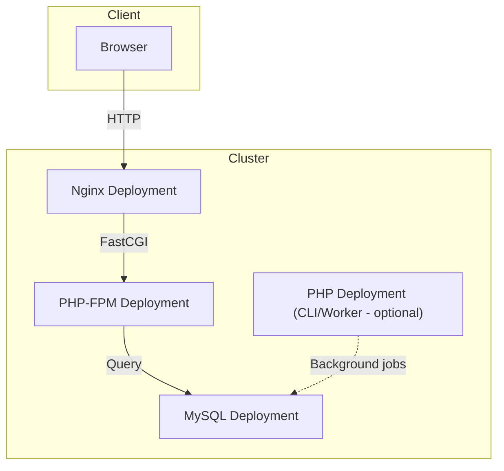

## Kiến trúc & mục tiêu

### Mục tiêu

Triển khai deployment stack Nginx + PHP-FPM + MySQL + Vue (static):

- 1 Deployment cho PHP-FPM
- 1 Deployment cho Nginx (proxy đến PHP)
- 1 Deployment cho MySQL (dùng PVC)
- 1 Service cho mỗi deployment
- 1 Ingress route vào Nginx

### Kiến trúc

- Namespace demo
- ConfigMap chứa file PHP + static (demo)
- Secret chứa MySQL password
- Deployment php-fpm (image php:8.1-fpm), mount /var/www/html
- Deployment php (ví dụ worker or background; ở demo này là same image chạy sleep)
- Deployment nginx (image nginx:stable), mount nginx conf và webroot; reverse proxy .php → - php-fpm:9000
- Deployment mysql (image mysql:8.0), dùng PVC
- Service (ClusterIP) cho php-fpm, php, mysql, nginx
- Ingress route domain myapp.local → nginx service

### Step by step

- Tạo namespace
- Tạo Secret cho MySQL
- Tạo ConfigMap chứa code + nginx config
- Tạo PVC (PersistentVolumeClaim) cho MySQL
- Tạo Deployment + Service cho MySQL
- Tạo Deployment + Service cho php-fpm
- Tạo Deployment + Service cho php (worker)
- Tạo Deployment + Service cho nginx
- Tạo Ingress và thêm entry myapp.local → Minikube IP vào /etc/hosts
- Kiểm tra, debug, scale nếu cần

### Kiến trúc

| Layer              | Kubernetes Object                           | Mục đích                                 |
| ------------------ | ------------------------------------------- | ---------------------------------------- |
| Nginx              | Deployment + Service                        | Reverse proxy, serve static, forward PHP |
| PHP-FPM            | Deployment + Service                        | Xử lý request PHP                        |
| MySQL              | Deployment + PVC + Service                  | Database, có storage riêng               |
| Vue (static build) | Deployment + Service hoặc ConfigMap mounted | Serve frontend                           |
| Queue Worker       | Deployment                                  | Xử lý background job                     |
| Migrate / Seed     | Job (one-off)                               | Chạy lệnh khởi tạo DB                    |
| Cron Job           | CronJob                                     | Tác vụ định kỳ (gửi mail, cleanup, v.v.) |
