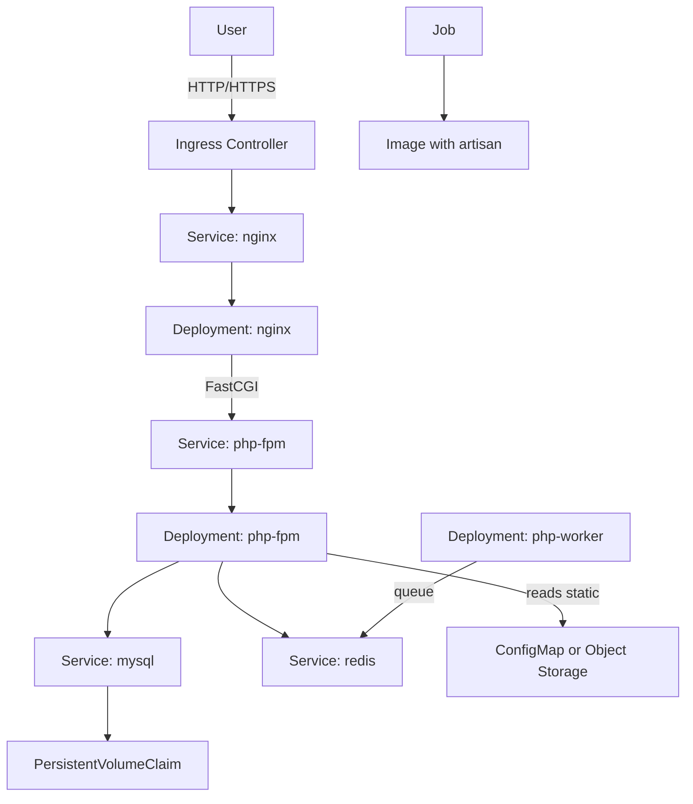

## Diagram tổng quan (overview)



```
plant-shop/                      # repo root
├─ backend/                      # Laravel app (BE)
│  ├─ app/
│  ├─ bootstrap/
│  ├─ config/
│  ├─ database/
│  │  ├─ migrations/
│  │  └─ seeders/
│  ├─ docker/                    # docker/nginx/php config cho BE
│  │  ├─ php/
│  │  │  └─ Dockerfile           # php-fpm image (dev/prod)
│  │  └─ nginx/
│  │     └─ site.conf            # nginx conf (proxy -> php-fpm + serve /public)
│  ├─ public/                    # public assets (Vue build sẽ copy vào đây hoặc serve rời)
│  ├─ resources/
│  ├─ routes/
│  ├─ storage/
│  ├─ tests/
│  ├─ .env.example
│  ├─ composer.json
│  └─ Makefile                   # scripts helper (composer, artisan, migrate...)
│
├─ frontend/                     # Vue app (FE)
│  ├─ src/
│  ├─ public/
│  ├─ docker/
│  │  └─ Dockerfile               # build static assets (multi-stage)
│  ├─ package.json
│  └─ .env.example
│
├─ k8s/                          # manifests kubernetes (dev/staging/production)
│  ├─ base/                      # common manifests (namespace, secrets.template,...)
│  ├─ overlays/
│  │  ├─ dev/                    # dev/staging overrides (images tags, replicas small)
│  │  └─ prod/                   # production overrides
│  ├─ mysql/
│  │  └─ mysql-statefulset.yaml
│  ├─ php-fpm-deployment.yaml
│  ├─ nginx-deployment.yaml
│  ├─ worker-deployment.yaml
│  ├─ job-migrate.yaml
│  ├─ ingress.yaml
│  └─ kustomization.yaml
│
├─ docker-compose.yml            # quick local stack: mysql, redis, php-fpm, nginx (dev)
├─ Makefile                      # repo-level helper commands
├─ .gitignore
└─ README.md
```